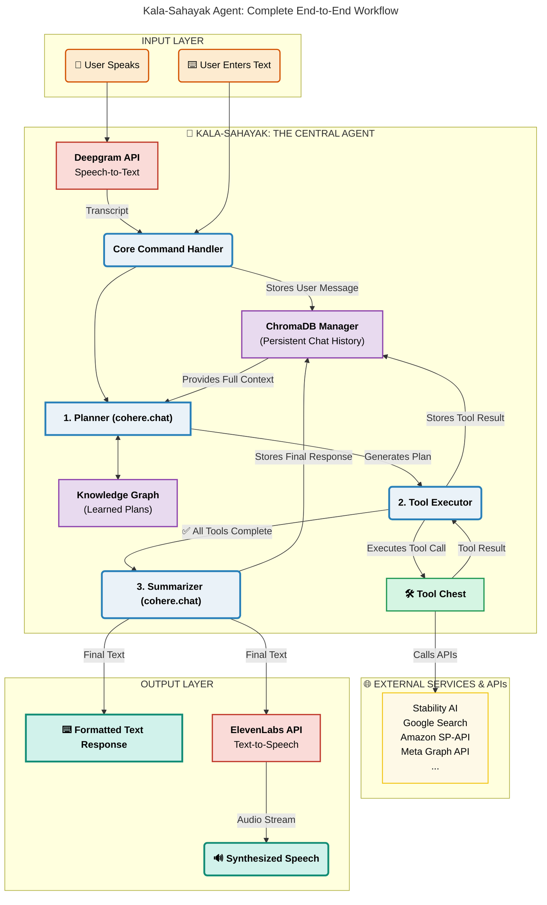

# Kala-Sahayak: Your AI Digital Marketing Ally 🤖

**Kala-Sahayak** (कला-सहायक, "Art Ally") is a sophisticated, multilingual AI agent designed as a strategic partner for Indian artisans and entrepreneurs. It integrates advanced AI capabilities for market research, e-commerce management, creative design, and social media automation, all accessible through a conversational text and voice interface.

This project was built to address the unique challenges faced by artisans and small business owners in the digital marketplace. Kala-Sahayak acts as a force multiplier, automating complex tasks like competitor analysis, content creation, and multi-platform publishing, allowing creators to focus on their craft.

## ✨ Core Features

-   **🧠 Intelligent Task Planning:** Decomposes complex user requests into logical, multi-step plans using Cohere's Command R+ model.
-   **🛠️ Rich Toolset:** Integrates with a wide array of services for market research (Google Search), e-commerce (Amazon), social media (Facebook, Instagram), and creative design (Stability AI, Gemini).
-   **🔊 Multi-Modal Interaction:** Supports both typed text commands and real-time, conversational voice interaction using Deepgram (Speech-to-Text) and ElevenLabs (Text-to-Speech).
-   **🎨 Generative AI Cascade:** Uses a two-stage LLM process for content creation. First, Gemini generates a detailed artistic prompt, which is then fed to Stability AI to produce a high-quality visual poster.
-   **💾 Persistent Conversation Memory:** Utilizes **ChromaDB** to store and retrieve conversation history, allowing for rich, multi-turn context to be maintained across sessions.
-   **💡 Adaptive Planning Memory:** Leverages a `KnowledgeGraph` to remember *successful plans* and adapt them for future, similar requests, improving speed and efficiency.
-   **🇮🇳 Cultural Context:** The agent's personality and communication style are tailored for an Indian context, with support for both English (India) and Hindi.

## 🚀 Tech Stack

-   **Core Programming Language:**
    -   Python
-   **Large Language Models (LLMs) & AI Services:**
    -   **Cohere:** For agent planning, reasoning, and summarization (Command R+).
    -   **Google Gemini:** For creative prompt generation and data synthesis.
    -   **Stability AI:** For text-to-image generation.
-   **Voice Technologies:**
    -   **Deepgram:** For real-time speech-to-text transcription.
    -   **ElevenLabs:** For high-quality, natural text-to-speech synthesis.
-   **Databases & Memory:**
    -   **ChromaDB:** For persistent vector storage of conversation history.
    -   **SQLite:** For the knowledge graph of successful plans.

## 📈 Agent Workflow Diagram

This diagram illustrates the complete end-to-end process, including the new persistent chat history powered by ChromaDB.


```mermaid
---
title: "Kala-Sahayak Agent: Complete End-to-End Workflow"
---
graph TD
    %% ====== STYLES DEFINITION ======
    classDef userInput fill:#fdebd0,stroke:#d35400,stroke-width:2px,color:#000
    classDef agentBrain fill:#eaf2f8,stroke:#2980b9,stroke-width:3px,color:#000
    classDef agentMemory fill:#e8daef,stroke:#8e44ad,stroke-width:2px,color:#000
    classDef toolChest fill:#d5f5e3,stroke:#229954,stroke-width:2px,color:#000
    classDef externalAPI fill:#fef9e7,stroke:#f1c40f,stroke-width:1.5px,color:#000
    classDef finalOutput fill:#d1f2eb,stroke:#138d75,stroke-width:3px,color:#000
    classDef voiceComponent fill:#fadbd8,stroke:#c0392b,stroke-width:2px,color:#000

    %% ====== PHASE 1: USER INPUT ======
    subgraph "INPUT LAYER"
        direction LR
        UserInputText("⌨️ User Enters Text"):::userInput
        UserSpeaks("🎤 User Speaks"):::userInput
    end

    %% ====== PHASE 2: AGENT'S CORE LOGIC ======
    subgraph "🧠 KALA-SAHAYAK: THE CENTRAL AGENT"
        direction TB
        UserSpeaks --> Deepgram["<b>Deepgram API</b><br/>Speech-to-Text"]:::voiceComponent
        Deepgram -- "Transcript" --> CoreHandler
        UserInputText --> CoreHandler("<b>Core Command Handler</b>"):::agentBrain
        
        CoreHandler -- "Stores User Message" --> ChromaDBManager["<b>ChromaDB Manager</b><br/>(Persistent Chat History)"]:::agentMemory

        CoreHandler --> Planner["<b>1. Planner (cohere.chat)</b>"]:::agentBrain
        Planner <--> KnowledgeGraph["<b>Knowledge Graph</b><br/>(Learned Plans)"]:::agentMemory
        ChromaDBManager -- "Provides Full Context" --> Planner

        Planner -- "Generates Plan" --> Executor
        Executor("<b>2. Tool Executor</b>"):::agentBrain
        Executor -- "Executes Tool Call" --> ToolBox["<b>🛠️ Tool Chest</b>"]:::toolChest
        ToolBox -- "Tool Result" --> Executor
        Executor -- "Stores Tool Result" --> ChromaDBManager

        Executor -- "✅ All Tools Complete" --> Summarizer
        Summarizer("<b>3. Summarizer (cohere.chat)</b>"):::agentBrain
        Summarizer -- "Stores Final Response" --> ChromaDBManager
    end

    %% ====== PHASE 3: EXTERNAL SERVICES ======
    subgraph "🌐 EXTERNAL SERVICES & APIs"
        ToolBox -- "Calls APIs" --> APIs["Stability AI<br/>Google Search<br/>Amazon SP-API<br/>Meta Graph API<br/>..."]:::externalAPI
    end

    %% ====== PHASE 4: FINAL OUTPUT ======
    subgraph "OUTPUT LAYER"
        direction LR
        Summarizer -- "Final Text" --> TextResponse["<b>⌨️ Formatted Text Response</b>"]:::finalOutput
        Summarizer -- "Final Text" --> ElevenLabs["<b>ElevenLabs API</b><br/>Text-to-Speech"]:::voiceComponent
        ElevenLabs -- "Audio Stream" --> AudioOutput("<b>🔊 Synthesized Speech</b>"):::finalOutput
    end
```

## ⚙️ Getting Started

Follow these steps to get the agent running on your local machine.

### Prerequisites

-   Python 3.9+
-   `pip` for package installation

### Installation

1.  **Clone the repository:**
    ```bash
    git clone https://github.com/Debajyoti2004/Digital-Marketing-Agent.git
    cd Digital-Marketing-Agent
    ```

2.  **Create a `requirements.txt` file** with the following content:
    ```
    cohere
    deepgram-sdk
    elevenlabs
    requests
    rich
    beautifulsoup4
    Pillow
    google-generativeai
    chromadb
    ```
3.  **Install all dependencies:**
    ```bash
    pip install -r requirements.txt
    ```

4.  **Configure your API Keys:**
    -   Create a new file named `config.py` in the root directory.
    -   **Important:** Add `config.py` to your `.gitignore` file to avoid committing your secret keys.
    -   Populate `config.py` with your keys as shown below:

    ```python
    # config.py - Do not commit this file to version control

    # 🧠 Core LLM and Voice
    COHERE_API_KEY = "YOUR_COHERE_API_KEY"
    DEEPGRAM_API_KEY = "YOUR_DEEPGRAM_API_KEY"
    ELEVENLABS_API_KEY = "YOUR_ELEVENLABS_API_KEY"
    ELEVENLABS_VOICE_ID = "21m00Tcm4TlvDq8ikWAM" # Example: Rachel

    # 🎨 Creative & Research APIs
    GENAI_API_KEY = "YOUR_GOOGLE_GEMINI_API_KEY"
    STABILITY_API_KEY = "YOUR_STABILITY_AI_API_KEY"
    GOOGLE_SEARCH_API_KEY = "YOUR_GOOGLE_SEARCH_API_KEY"
    GOOGLE_SEARCH_CX_ID = "YOUR_PROGRAMMABLE_SEARCH_ENGINE_ID"

    # 🛠️ Platform-Specific APIs (Fill as needed)
    # ... etc.
    ```

### Usage

Run the main agent file from your terminal:
```bash
python main_agent.py
```
You will be prompted to select your preferred language and interaction mode (Text or Voice). In text mode, you can type `new session` to clear the conversation history and start fresh.

## 📂 Codebase Overview

### 🧠 `main_agent.py` - The Brain
-   **Purpose:** The central orchestrator of the agent.
-   **Responsibilities:** Manages the main conversation loop, initializes all API clients, and orchestrates the **Plan → Execute → Summarize** workflow. Contains the agent's core personality (`Preamble`) and maps tool names to their Python functions. It now uses the `ChromaDBManager` to maintain persistent conversation history.

### 💾 `chroma_manager.py` - The Persistent Memory
-   **Symbol:** 💾
-   **Purpose:** Manages the storage and retrieval of the entire conversation flow.
-   **Responsibilities:** Encapsulates all interactions with the ChromaDB vector store. It handles adding user, chatbot, and tool messages with timestamps, and retrieves the history in the correct format for the Cohere API, ensuring context is maintained across sessions.

### 🛠️ `tool_definitions.py` - The Tool Catalog
-   **Purpose:** Defines the complete list of capabilities available to the agent.
-   **Responsibilities:** Structures each tool with a name, a clear description for the LLM, and parameter definitions. This file is the "menu" the Planner LLM uses to build its action plans.

### 🔍 `market_research.py` - The Analyst
-   **Purpose:** Contains all tools for market intelligence and web analysis.
-   **Responsibilities:** Connects to **Google Search API** for web searches, uses **BeautifulSoup** to scrape webpage data, and leverages **Gemini** to synthesize research findings into actionable strategy.

### 🎨 `design_api.py` - The Creative Director
-   **Purpose:** Manages all creative generation tasks.
-   **Responsibilities:** Implements the generative AI cascade by using **Gemini** to create artistic prompts and then sending those prompts to **Stability AI** to generate poster images. Also handles local image display with **Pillow**.

### 💡 `knowledge_graph.py` - The Planning Memory
-   **Purpose:** Provides the agent with the ability to learn from *past successes*.
-   **Responsibilities:** Stores and retrieves successful *multi-step plans*. This is distinct from chat history and allows the agent to quickly solve similar problems in the future without planning from scratch.

### 🛒 `(platform)_api.py` (e.g., `amazon_api.py`) - The Specialists
-   **Purpose:** These files contain classes specialized for a single platform API.
-   **Responsibilities:** Handle the specific authentication and request formatting required by services like Amazon SP-API, Meta Graph API, etc., translating the agent's high-level goals into concrete API calls.

## 🤝 Contributing

Contributions are welcome! If you'd like to contribute, please fork the repository and create a pull request. You can also open an issue with the tag "enhancement".

1.  Fork the Project
2.  Create your Feature Branch (`git checkout -b feature/AmazingFeature`)
3.  Commit your Changes (`git commit -m 'Add some AmazingFeature'`)
4.  Push to the Branch (`git push origin feature/AmazingFeature`)
5.  Open a Pull Request
