# Kala-Sahayak: The Ultimate AI Co-Founder for Artisans

**Kala-Sahayak (कला-सहायक)** is a state-of-the-art, voice-enabled AI agent designed to act as a strategic partner for Indian artisans and small business owners. Built with a sophisticated, self-correcting graph-based architecture, this agent goes beyond simple commands to offer proactive, data-driven assistance in marketing, e-commerce, and generative AI.

## ✨ Core Features

- **🧠 Self-Correcting Intelligence:** The agent learns from both successes and failures. User feedback on a failed plan is used to automatically generate a better, corrected plan.
- **📚 Long-Term Strategic Memory:** Utilizes a **Neo4j Knowledge Graph** to store and retrieve successful strategic plans, preventing repeated mistakes and becoming more efficient over time.
- **💬 Contextual Conversational Memory:** A **ChromaDB Vector Store** maintains conversational history, allowing for nuanced follow-up questions and a deep understanding of the user's context.
- **🌐 On-the-Fly Website Generation:** Autonomously generates complete, multi-page, responsive websites (HTML, CSS, JS) from a simple description, including deployment and local previews.
- **🎤 Fully Interruptible Voice:** Built with `asyncio`, Deepgram, and ElevenLabs, the agent provides a natural, real-time voice experience where the user can interrupt the agent at any time.
- **🎭 Dual-Persona System:** Operates in two distinct modes:
  - **👑 Owner Mode:** A powerful co-founder with a full suite of 35+ tools for marketing, sales, design, website management, and business intelligence.
  - **👤 Customer Mode:** A friendly, helpful support assistant with no access to tools, designed to answer customer questions and escalate when necessary.
- **🛠️ Multi-Step Tool Chaining:** Powered by LangGraph, the agent can autonomously execute complex, multi-step workflows, such as researching competitors, analyzing the data, and then creating a product listing based on the results.

## 🛠️ Tech Stack & Key Components

- **Orchestration:** LangGraph
- **LLMs:** Cohere Command R+ (Reasoning & Planning), Google Gemini 1.5 Pro (Content Generation & Classification)
- **Memory:** Neo4j (Strategic Knowledge Graph), ChromaDB (Conversational Vector Store)
- **Voice:** Deepgram (Real-time STT), ElevenLabs (Real-time TTS)
- **Creative AI:** Google Gemini (Website Generation), Stability AI (Image Generation), remove.bg (Photo Enhancement)
- **Platform Integrations:** Facebook, Instagram, Amazon, WhatsApp
- **Business Intelligence:** Pandas, StatsModels, FPDF2
- **Web Interaction:** Requests, BeautifulSoup4
- **CLI:** Rich (for styled terminal UI)

## 🧠 Architecture: The Self-Correcting Agent Brain

The agent's intelligence is built on a cyclical, stateful graph using LangGraph. Instead of a simple input-output loop, the agent moves through a series of nodes, allowing it to plan, act, analyze results, and re-plan until a goal is achieved.

### Workflow Diagram

```mermaid
---
title: 🚀 Kala-Sahayak Agent - Stateful Learning Workflow
---
graph TD
    subgraph "User Interaction"
        UserInput["🧑 User provides a command"] --> A(Start Agent Workflow)
    end

    subgraph "Kala-Sahayak Agent Core Logic (LangGraph)"

        A --> B(🧠 Load Memories)
        B -- Query for context --> ChromaDB[(🗄️ ChromaDB Vector Store)]
        ChromaDB -- Return relevant memories --> B

        B --> C{🤔 Classify Intent}

        C -- general_conversation --> D(💬 General Conversation Node)
        D -- Generate conversational text --> K(🗣️ Present Final Response to User)

        C -- tool_use --> E(🔍 Find Strategic Plan)
        E -- Query for successful plan --> Neo4j[(🌳 Neo4j Knowledge Graph)]
        Neo4j -- Return cached plan or null --> E

        E --> F{♻️ Successful Plan Found in KG?}
        F -- Yes --> G(🧠 Brain: Adapt Cached Plan)
        F -- No --> H(💡 Brain: Generate New Plan)
        subgraph "Iterative Execution Loop"
            G -- Adapted Plan --> I{🛠️ Tool Calls Present?}
            H -- New Plan --> I

            I -- Yes --> J(⚙️ Execute Tools)
            J -- Return tool results to context --> H
        end

        I -- "No / Task Complete" --> K

    end

    subgraph "User Interaction & Learning Loop"
        K --> UserFeedback["👍 Owner provides feedback"]
        UserFeedback --> L(⚖️ Evaluate & Learn)

        L -- Store successful plan --> Neo4j
        L -- Store failed plan and feedback --> Neo4j

        L --> M([🏁 END])
    end


    %% Styling
    style UserInput fill:#D2B4DE,stroke:#8E44AD,stroke-width:2px
    style UserFeedback fill:#D2B4DE,stroke:#8E44AD,stroke-width:2px
    style ChromaDB fill:#A9CCE3,stroke:#2980B9,stroke-width:2px,stroke-dasharray: 5 5
    style Neo4j fill:#A9DFBF,stroke:#27AE60,stroke-width:2px,stroke-dasharray: 5 5
    style J fill:#A3E4D7,stroke:#16A085,stroke-width:2px
    style H fill:#FAD7A0,stroke:#F39C12,stroke-width:2px
    style G fill:#FAD7A0,stroke:#F39C12,stroke-width:2px
    style L fill:#F5B7B1,stroke:#C0392B,stroke-width:2px
    style M fill:#E5E7E9,stroke:#95A5A6,stroke-width:2px
    style K fill:#AED6F1,stroke:#3498DB,stroke-width:2px
```



## 💬 Interaction Flows

### 🔊 Voice Flow (Interruptible Conversation)

The voice mode is designed for a natural, fluid conversation.

1.  **Agent Greets User:** The agent starts the session with a welcome message using ElevenLabs TTS.
2.  **User Speaks:** The `listen()` method activates Deepgram's real-time transcription.
3.  **Real-time Interruption:** As the user speaks, Deepgram sends interim transcription results. The moment any transcript text is detected, the agent's `interrupt_speech()` method is called, which immediately stops any ongoing ElevenLabs playback.
4.  **Command Queued:** Once the user finishes speaking, the final, complete transcript is placed into an `asyncio.Queue`.
5.  **Agent Processes:** The `_process_voice_tasks()` loop retrieves the command from the queue and sends it to the LangGraph workflow (`get_agent_response`).
6.  **Agent Responds:** The final text response from the graph is sent to the `speak()` method, which generates and plays the audio response.
7.  **Feedback Loop:** After a tool-based action, the agent will ask for feedback. The user's spoken reply ("Yes", "No", or a correction) is captured and processed to either save the plan or trigger the self-correction loop.

### ⌨️ Text Flow (Interactive Learning Loop)

The text mode provides a clear, step-by-step interaction that highlights the agent's learning capabilities.

1.  **User Enters Command:** The user types a command into the terminal.
2.  **Agent Processes:** The command is sent to the LangGraph workflow via `get_agent_response`. The agent executes the full `PLAN -> EXECUTE -> ANALYZE -> RE-PLAN` loop until it arrives at a final answer.
3.  **Agent Responds:** The final text response is printed to the console in a formatted `Panel`.
4.  **Feedback Prompt:** If the user is in the "Owner" role and the agent executed a plan, the agent will prompt for feedback: `👍 Was this result helpful? (yes/no or provide correction):`
5.  **User Provides Feedback:**
    - **"yes"**: The agent calls the Knowledge Graph to `store_successful_plan` and ends the current interaction loop, ready for a new command.
    - **"no"**: The agent calls the Knowledge Graph to `store_failed_plan` with a generic "not satisfied" message. The interaction loop ends.
    - **Corrective Text** (e.g., "the price is too high, make it cheaper"): The agent calls `store_failed_plan` with the user's text as the feedback. It then **re-enters the LangGraph workflow**, adding the user's correction to the message history. The `PREAMBLE_OWNER`'s directives force the agent to analyze this feedback and generate a _new, improved plan_.

## 🚀 Setup & Installation

1.  **Clone the Repository**

    ```bash
    git clone https://github.com/Debajyoti2004/Digital-Marketing-Agent.git
    cd Digital-Marketing-Agent
    ```

2.  **Install Dependencies**
    Create a `requirements.txt` file with the following content and run `pip install -r requirements.txt`.

    ```
    beautifulsoup4
    chromadb
    cohere
    deepgram-sdk
    elevenlabs
    fpdf2
    google-generativeai
    httpx
    langchain-core
    langgraph
    moviepy
    neo4j
    pandas
    removebg
    rich
    statsmodels
    ```

3.  **Configure API Keys**
    Fill in your credentials in the `config.py` file. You will need keys for:

    - Cohere
    - Google (for Gemini & Custom Search API)
    - Neo4j (Database URI, User, Password)
    - Deepgram
    - ElevenLabs (& Voice ID)
    - Stability AI
    - remove.bg

4.  **Setup Databases**
    - Ensure your Neo4j database is running and accessible.
    - ChromaDB will automatically create its local database files on the first run.

## ▶️ How to Run

Execute the main agent file from your terminal:

````bash
python main_agent.py```

You will be prompted to select:

1.  Your preferred language (English or Hindi).
2.  Your role (Owner or Customer).
3.  Your interaction mode (Voice or Text).
````
